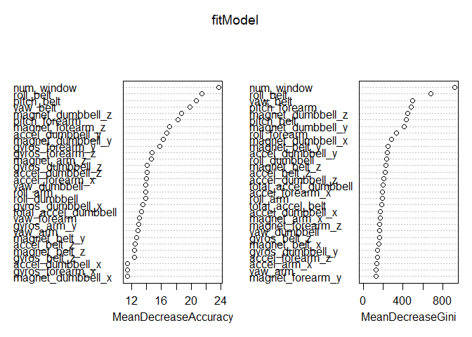

# Prediction Assignment: Practical Machine Learning; Write-up
Deepak Raja  
19 September 2016  

## Background

Using devices such as Jawbone Up, Nike FuelBand, and Fitbit it is now possible to collect a large amount of data about personal activity relatively inexpensively. These type of devices are part of the quantified self movement - a group of enthusiasts who take measurements about themselves regularly to improve their health, to find patterns in their behavior, or because they are tech geeks. One thing that people regularly do is quantify how much of a particular activity they do, but they rarely quantify how well they do it. In this project, your goal will be to use data from accelerometers on the belt, forearm, arm, and dumbell of 6 participants. They were asked to perform barbell lifts correctly and incorrectly in 5 different ways. More information is available from the website here: http://groupware.les.inf.puc-rio.br/har (see the section on the Weight Lifting Exercise Dataset).

The goal of this project is to predict the manner in which the participants did the exercise. This is the classe variable of the training set, which classifies the correct and incorrect outcomes into A, B, C, D, and E categories.(five different fashions: exactly according to the specification (Class A), throwing the elbows to the front (Class B), lifting the dumbbell only halfway (Class C), lowering the dumbbell only halfway (Class D) and throwing the hips to the front (Class E)).

This report describes how the prediction model for the project was built, its cross validation, expected out of sample error calculation, and the choices made. It was used successfully to accurately predict all 20 different test cases on the Quiz.

This document is the write-up submission for the course Practical Machine Learning, This 4-week course was offered on Coursera, and is part of Johns Hopkins Data Science Specialization.

## Data Description and cleaning

The training data for this project are available here:
https://d396qusza40orc.cloudfront.net/predmachlearn/pml-training.csv

The test data are available here:
https://d396qusza40orc.cloudfront.net/predmachlearn/pml-testing.csv

The data for this project come from this source:
http://groupware.les.inf.puc-rio.br/har 

We load the data in R while taking care of NA strings:


```r
library(caret)
```

```
## Loading required package: lattice
```

```
## Loading required package: ggplot2
```

```r
training <- read.csv("pml-training.csv", na.strings = c("NA", "#DIV/0!", ""))
testing  <- read.csv("pml-testing.csv",  na.strings = c("NA", "#DIV/0!", ""))

# having a look at the structure and of data

dim(training)
```

```
## [1] 19622   160
```

```r
str(training) # shows it has many variables with NAs , first 6 columns is just info, not records
```

```
## 'data.frame':	19622 obs. of  160 variables:
##  $ X                       : int  1 2 3 4 5 6 7 8 9 10 ...
##  $ user_name               : Factor w/ 6 levels "adelmo","carlitos",..: 2 2 2 2 2 2 2 2 2 2 ...
##  $ raw_timestamp_part_1    : int  1323084231 1323084231 1323084231 1323084232 1323084232 1323084232 1323084232 1323084232 1323084232 1323084232 ...
##  $ raw_timestamp_part_2    : int  788290 808298 820366 120339 196328 304277 368296 440390 484323 484434 ...
##  $ cvtd_timestamp          : Factor w/ 20 levels "02/12/2011 13:32",..: 9 9 9 9 9 9 9 9 9 9 ...
##  $ new_window              : Factor w/ 2 levels "no","yes": 1 1 1 1 1 1 1 1 1 1 ...
##  $ num_window              : int  11 11 11 12 12 12 12 12 12 12 ...
##  $ roll_belt               : num  1.41 1.41 1.42 1.48 1.48 1.45 1.42 1.42 1.43 1.45 ...
##  $ pitch_belt              : num  8.07 8.07 8.07 8.05 8.07 8.06 8.09 8.13 8.16 8.17 ...
##  $ yaw_belt                : num  -94.4 -94.4 -94.4 -94.4 -94.4 -94.4 -94.4 -94.4 -94.4 -94.4 ...
##  $ total_accel_belt        : int  3 3 3 3 3 3 3 3 3 3 ...
##  $ kurtosis_roll_belt      : num  NA NA NA NA NA NA NA NA NA NA ...
##  $ kurtosis_picth_belt     : num  NA NA NA NA NA NA NA NA NA NA ...
##  $ kurtosis_yaw_belt       : logi  NA NA NA NA NA NA ...
##  $ skewness_roll_belt      : num  NA NA NA NA NA NA NA NA NA NA ...
##  $ skewness_roll_belt.1    : num  NA NA NA NA NA NA NA NA NA NA ...
##  $ skewness_yaw_belt       : logi  NA NA NA NA NA NA ...
##  $ max_roll_belt           : num  NA NA NA NA NA NA NA NA NA NA ...
##  $ max_picth_belt          : int  NA NA NA NA NA NA NA NA NA NA ...
##  $ max_yaw_belt            : num  NA NA NA NA NA NA NA NA NA NA ...
##  $ min_roll_belt           : num  NA NA NA NA NA NA NA NA NA NA ...
##  $ min_pitch_belt          : int  NA NA NA NA NA NA NA NA NA NA ...
##  $ min_yaw_belt            : num  NA NA NA NA NA NA NA NA NA NA ...
##  $ amplitude_roll_belt     : num  NA NA NA NA NA NA NA NA NA NA ...
##  $ amplitude_pitch_belt    : int  NA NA NA NA NA NA NA NA NA NA ...
##  $ amplitude_yaw_belt      : num  NA NA NA NA NA NA NA NA NA NA ...
##  $ var_total_accel_belt    : num  NA NA NA NA NA NA NA NA NA NA ...
##  $ avg_roll_belt           : num  NA NA NA NA NA NA NA NA NA NA ...
##  $ stddev_roll_belt        : num  NA NA NA NA NA NA NA NA NA NA ...
##  $ var_roll_belt           : num  NA NA NA NA NA NA NA NA NA NA ...
##  $ avg_pitch_belt          : num  NA NA NA NA NA NA NA NA NA NA ...
##  $ stddev_pitch_belt       : num  NA NA NA NA NA NA NA NA NA NA ...
##  $ var_pitch_belt          : num  NA NA NA NA NA NA NA NA NA NA ...
##  $ avg_yaw_belt            : num  NA NA NA NA NA NA NA NA NA NA ...
##  $ stddev_yaw_belt         : num  NA NA NA NA NA NA NA NA NA NA ...
##  $ var_yaw_belt            : num  NA NA NA NA NA NA NA NA NA NA ...
##  $ gyros_belt_x            : num  0 0.02 0 0.02 0.02 0.02 0.02 0.02 0.02 0.03 ...
##  $ gyros_belt_y            : num  0 0 0 0 0.02 0 0 0 0 0 ...
##  $ gyros_belt_z            : num  -0.02 -0.02 -0.02 -0.03 -0.02 -0.02 -0.02 -0.02 -0.02 0 ...
##  $ accel_belt_x            : int  -21 -22 -20 -22 -21 -21 -22 -22 -20 -21 ...
##  $ accel_belt_y            : int  4 4 5 3 2 4 3 4 2 4 ...
##  $ accel_belt_z            : int  22 22 23 21 24 21 21 21 24 22 ...
##  $ magnet_belt_x           : int  -3 -7 -2 -6 -6 0 -4 -2 1 -3 ...
##  $ magnet_belt_y           : int  599 608 600 604 600 603 599 603 602 609 ...
##  $ magnet_belt_z           : int  -313 -311 -305 -310 -302 -312 -311 -313 -312 -308 ...
##  $ roll_arm                : num  -128 -128 -128 -128 -128 -128 -128 -128 -128 -128 ...
##  $ pitch_arm               : num  22.5 22.5 22.5 22.1 22.1 22 21.9 21.8 21.7 21.6 ...
##  $ yaw_arm                 : num  -161 -161 -161 -161 -161 -161 -161 -161 -161 -161 ...
##  $ total_accel_arm         : int  34 34 34 34 34 34 34 34 34 34 ...
##  $ var_accel_arm           : num  NA NA NA NA NA NA NA NA NA NA ...
##  $ avg_roll_arm            : num  NA NA NA NA NA NA NA NA NA NA ...
##  $ stddev_roll_arm         : num  NA NA NA NA NA NA NA NA NA NA ...
##  $ var_roll_arm            : num  NA NA NA NA NA NA NA NA NA NA ...
##  $ avg_pitch_arm           : num  NA NA NA NA NA NA NA NA NA NA ...
##  $ stddev_pitch_arm        : num  NA NA NA NA NA NA NA NA NA NA ...
##  $ var_pitch_arm           : num  NA NA NA NA NA NA NA NA NA NA ...
##  $ avg_yaw_arm             : num  NA NA NA NA NA NA NA NA NA NA ...
##  $ stddev_yaw_arm          : num  NA NA NA NA NA NA NA NA NA NA ...
##  $ var_yaw_arm             : num  NA NA NA NA NA NA NA NA NA NA ...
##  $ gyros_arm_x             : num  0 0.02 0.02 0.02 0 0.02 0 0.02 0.02 0.02 ...
##  $ gyros_arm_y             : num  0 -0.02 -0.02 -0.03 -0.03 -0.03 -0.03 -0.02 -0.03 -0.03 ...
##  $ gyros_arm_z             : num  -0.02 -0.02 -0.02 0.02 0 0 0 0 -0.02 -0.02 ...
##  $ accel_arm_x             : int  -288 -290 -289 -289 -289 -289 -289 -289 -288 -288 ...
##  $ accel_arm_y             : int  109 110 110 111 111 111 111 111 109 110 ...
##  $ accel_arm_z             : int  -123 -125 -126 -123 -123 -122 -125 -124 -122 -124 ...
##  $ magnet_arm_x            : int  -368 -369 -368 -372 -374 -369 -373 -372 -369 -376 ...
##  $ magnet_arm_y            : int  337 337 344 344 337 342 336 338 341 334 ...
##  $ magnet_arm_z            : int  516 513 513 512 506 513 509 510 518 516 ...
##  $ kurtosis_roll_arm       : num  NA NA NA NA NA NA NA NA NA NA ...
##  $ kurtosis_picth_arm      : num  NA NA NA NA NA NA NA NA NA NA ...
##  $ kurtosis_yaw_arm        : num  NA NA NA NA NA NA NA NA NA NA ...
##  $ skewness_roll_arm       : num  NA NA NA NA NA NA NA NA NA NA ...
##  $ skewness_pitch_arm      : num  NA NA NA NA NA NA NA NA NA NA ...
##  $ skewness_yaw_arm        : num  NA NA NA NA NA NA NA NA NA NA ...
##  $ max_roll_arm            : num  NA NA NA NA NA NA NA NA NA NA ...
##  $ max_picth_arm           : num  NA NA NA NA NA NA NA NA NA NA ...
##  $ max_yaw_arm             : int  NA NA NA NA NA NA NA NA NA NA ...
##  $ min_roll_arm            : num  NA NA NA NA NA NA NA NA NA NA ...
##  $ min_pitch_arm           : num  NA NA NA NA NA NA NA NA NA NA ...
##  $ min_yaw_arm             : int  NA NA NA NA NA NA NA NA NA NA ...
##  $ amplitude_roll_arm      : num  NA NA NA NA NA NA NA NA NA NA ...
##  $ amplitude_pitch_arm     : num  NA NA NA NA NA NA NA NA NA NA ...
##  $ amplitude_yaw_arm       : int  NA NA NA NA NA NA NA NA NA NA ...
##  $ roll_dumbbell           : num  13.1 13.1 12.9 13.4 13.4 ...
##  $ pitch_dumbbell          : num  -70.5 -70.6 -70.3 -70.4 -70.4 ...
##  $ yaw_dumbbell            : num  -84.9 -84.7 -85.1 -84.9 -84.9 ...
##  $ kurtosis_roll_dumbbell  : num  NA NA NA NA NA NA NA NA NA NA ...
##  $ kurtosis_picth_dumbbell : num  NA NA NA NA NA NA NA NA NA NA ...
##  $ kurtosis_yaw_dumbbell   : logi  NA NA NA NA NA NA ...
##  $ skewness_roll_dumbbell  : num  NA NA NA NA NA NA NA NA NA NA ...
##  $ skewness_pitch_dumbbell : num  NA NA NA NA NA NA NA NA NA NA ...
##  $ skewness_yaw_dumbbell   : logi  NA NA NA NA NA NA ...
##  $ max_roll_dumbbell       : num  NA NA NA NA NA NA NA NA NA NA ...
##  $ max_picth_dumbbell      : num  NA NA NA NA NA NA NA NA NA NA ...
##  $ max_yaw_dumbbell        : num  NA NA NA NA NA NA NA NA NA NA ...
##  $ min_roll_dumbbell       : num  NA NA NA NA NA NA NA NA NA NA ...
##  $ min_pitch_dumbbell      : num  NA NA NA NA NA NA NA NA NA NA ...
##  $ min_yaw_dumbbell        : num  NA NA NA NA NA NA NA NA NA NA ...
##  $ amplitude_roll_dumbbell : num  NA NA NA NA NA NA NA NA NA NA ...
##   [list output truncated]
```

```r
table(training$classe) #tables of classe variable
```

```
## 
##    A    B    C    D    E 
## 5580 3797 3422 3216 3607
```

```r
prop.table(table(training$user_name, training$classe), 1) #proportion of classe varible in each user name
```

```
##           
##                    A         B         C         D         E
##   adelmo   0.2993320 0.1993834 0.1927030 0.1323227 0.1762590
##   carlitos 0.2679949 0.2217224 0.1584190 0.1561697 0.1956941
##   charles  0.2542421 0.2106900 0.1524321 0.1815611 0.2010747
##   eurico   0.2817590 0.1928339 0.1592834 0.1895765 0.1765472
##   jeremy   0.3459730 0.1437390 0.1916520 0.1534392 0.1651969
##   pedro    0.2452107 0.1934866 0.1911877 0.1796935 0.1904215
```

```r
# Data Cleaning
training <- training[, 7:160]# removes first 6 columns 
testing  <- testing[, 7:160]

is_data  <- apply(!is.na(training), 2, sum) == 19622  # removing columns which have even 1 NA
training <- training[, is_data]
testing  <- testing[, is_data]

#now we have relevant 54 variables in both training and testing dataset
```

### Modeling 

We partition the training dataset for cross validation purpose. in 65:35 proportion


```r
set.seed(2125)
inTrain <- createDataPartition(y=training$classe, p=0.65, list=FALSE)
train1  <- training[inTrain,]
train2  <- training[-inTrain,]
dim(train1)
```

```
## [1] 12757    54
```

```r
dim(train2)
```

```
## [1] 6865   54
```
We check for Zero Variance predictors in the training data set 


```r
length(nearZeroVar(train1)) 
```

```
## [1] 0
```
There are no neear zero predictors, therefore we need not make any further changes to testing varaibles.

### Random Forest Model

To find out the most relevant variables among 53 variables for prediction, we will use random forest (after trying rpart and tree, which gave very low accuracy)

```r
library(randomForest)
```

```
## randomForest 4.6-12
```

```
## Type rfNews() to see new features/changes/bug fixes.
```

```
## 
## Attaching package: 'randomForest'
```

```
## The following object is masked from 'package:ggplot2':
## 
##     margin
```

```r
set.seed(2125)
fitModel <- randomForest(classe~., data=train1, importance=TRUE, ntree=100)
varImpPlot(fitModel)
```

<!-- -->


We can see in the plot which variables are most important predictors, lets find out the OOB sample rate of the model


```r
fitModel
```

```
## 
## Call:
##  randomForest(formula = classe ~ ., data = train1, importance = TRUE,      ntree = 100) 
##                Type of random forest: classification
##                      Number of trees: 100
## No. of variables tried at each split: 7
## 
##         OOB estimate of  error rate: 0.37%
## Confusion matrix:
##      A    B    C    D    E class.error
## A 3626    0    0    0    1 0.000275710
## B   11 2456    2    0    0 0.005265290
## C    0    7 2216    2    0 0.004044944
## D    0    0   15 2075    1 0.007651841
## E    0    1    0    7 2337 0.003411514
```

Since the error rate is .37% for the sample, let us find out out of sample error rate by using the model on cross validation data set.


```r
tree.pred=predict(fitModel,train2,type="class")
predMatrix = with(train2,table(tree.pred,classe))
sum(diag(predMatrix))/sum(as.vector(predMatrix))
```

```
## [1] 0.9985433
```

we get accuracy of 99.85% on cross validation data. which is very good  for us. out of sample error rate is .15%. 


## Testing predictions 

We predict on the testing data with our Model


```r
predictions <- predict(fitModel, newdata=testing)
testing$classe <- predictions
```
## submission

we create a csv 

```r
submission <- data.frame(problem_id = testing$problem_id, classe = predictions)
write.csv(submission, file = "Assignment-submission.csv", row.names = FALSE)
```

We create seperate text files to upload for each answer


```r
answers <- testing$classe
write_files <- function(x){
  n <- length(x)
  for(i in 1:n){
    filename <- paste0("problem_",i,".txt")
    write.table(x[i], file=filename, quote=FALSE, row.names=FALSE, col.names=FALSE)
  }
}
write_files(answers)
```


